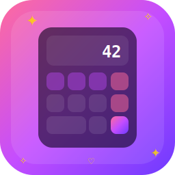

<div align="center">
  
  <h1>✨ Super Calculadora Anime ✨</h1>
  <p>Una calculadora moderna, hermosa y funcional para Windows 11 con cristalografía (Glassmorphism) y estilo anime.</p>
  
  <p>
    
    
    
    
  </p>
</div>

<br/>

## 🌟 Características Principales

*   **⚡ Interfaz Glassmorphism:** Diseño increíblemente moderno, fondo translúcido con desenfoque (`backdrop-filter`) y bordes suaves de Windows 11.
*   **🌸 Estética Anime:** Efectos de partículas en el fondo, destellos (glow), gradientes de color vibrante (Rosa/Cian) y un personaje SVG integrado decorativo.
*   **🔬 Modo Científico Oculto:** Expande la calculadora para revelar funciones avanzadas (Senos, Cosenos, Raíces, Logaritmos, Tangentes, Factoriales y más). Alterna fácilmente entre Grados (DEG) y Radianes (RAD).
*   **📜 Historial de Cálculos:** Un panel lateral desplegable y animado que lleva un registro de todas las operaciones realizadas durante tu sesión.
*   **⌨️ Soporte Completo de Teclado:** Utiliza tu NumPad y el teclado para matemáticas súper rápidas sin tocar el ratón.
*   **💻 Ventana Frameless:** Controles personalizados (Cerrar, Maximizar, Minimizar) incrustados nativamente en el diseño de la app.

## 📦 Descarga / Instalación Directa

Si solo quieres usar la aplicación en tu computadora Windows, puedes ir a la sección de **Releases** de este repositorio o generar tu mismo el instalador siguiendo las instrucciones abajo. ¡La app incluye su propio instalador autónomo (`.exe`) creado con NSIS!

## 🚀 Cómo correr el proyecto localmente

Si eres desarrollador y quieres modificar el código, necesitas tener [Node.js](https://nodejs.org/) instalado.

1.  **Clona este repositorio:**
    ```bash
    git clone https://github.com/Felix-37/Calculadora.git
    cd Calculadora
    ```

2.  **Instala las dependencias:**
    ```bash
    npm install
    ```

3.  **Inicia la aplicación en modo desarrollo:**
    ```bash
    npm start
    ```

## 🛠️ Cómo compilar el instalador (.exe)

Este proyecto está configurado con `electron-builder` para generar y firmar un paquete NSIS nativo que instala la aplicación en tu máquina como cualquier programa oficial. 

Para construir y empaquetar el instalador `.exe`:

```bash
npm run compile
```

Una vez que el comando haya terminado, encontrarás tu instalador (aprox. 60 MB) en la carpeta `dist/`, bajo el nombre `Super Calculadora Anime Setup 1.0.0.exe`.

## 📂 Organización del Proyecto

```text
Calculadora/
├── assets/                  # Iconos y arte vectorial SVG usado en el UI
├── dist/                    # Instaladores generados (se ignora en el repo)
├── scripts/
│   └── generate-icon.js     # Script que convierte el icon.svg a un .png compatible
├── src/
│   ├── calculator.js        # Motor matemático y manejo de teclado
│   ├── index.html           # Estructura del UI
│   ├── main.js              # Proceso Principal de Electron (ventana)
│   ├── preload.js           # Puente de seguridad IPC
│   └── styles.css           # Estilos con Glassmorphism y la estética Anime
├── package.json             # Dependencias y scripts
└── README.md
```

## 📜 Licencia

Este proyecto está bajo la Licencia MIT - ver el archivo [LICENSE](LICENSE) para más detalles. ¡Siéntete libre de modificar, adaptar y mejorar tu propia calculadora!
